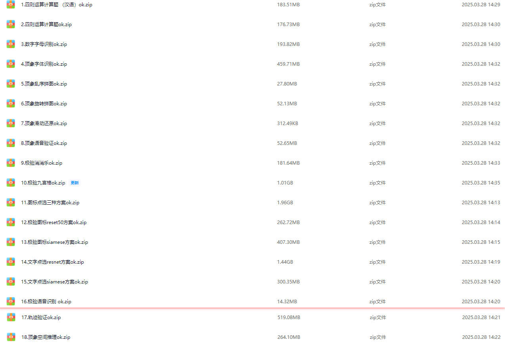
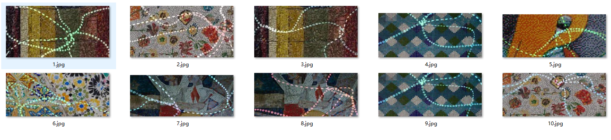

# 声明：本教程只能用于教学目的，如果用于非法目的与本人无关

--------------- 广告 ---------------
## 本人24个验证码实战视频教程，后续会更新十几个，每个教程都有配套的数据样本，训练代码，成品模型，推测代码，2k出售，有问题可以随时问，详情联系本人：tomysky67


## 试看视频 顶象空间推理.mkv 链接: https://pan.baidu.com/s/1ly-wmD5GMHpwTb2PpF8-ww?pwd=6666 提取码: 6666
--------------- 广告 ---------------

## 视频详解地址：https://www.bilibili.com/video/BV1qhHseLESh/?vd_source=4e60c6c3075c23c4aef0f545b39459b8

## 教程素材网址：https://github.com/tomysky/calc_max_area

## 1.分析



> ​	图像有明显的白色或者青色的小圆勾画出轮廓。我们需要提取白色的小圆点，连成一条线，把图像分割成几个小块，找到最大的那个。

## 2.代码及详细解读

### 1. 读取图像并显示

首先，代码读取图像并将其显示出来。这个步骤的目的是确保图像已被正确加载，并为后续处理提供基础。

### 2. 灰度化处理

将彩色图像转换为灰度图像：

```python
gray = cv2.cvtColor(img, cv2.COLOR_BGR2GRAY)
```

彩色图像包含三个颜色通道（红、绿、蓝），每个通道的信息量大、计算复杂。为了减少计算量并简化后续处理，通常会将图像转换为单通道的灰度图。灰度图保留了亮度信息，便于进一步分析和处理。

### 3. 高斯模糊

```python
gray = cv2.GaussianBlur(gray, (7, 7), 0)
```

高斯模糊用于平滑图像，减少噪声和细节。在图像处理任务中，噪声可能会干扰边缘检测和角点检测。高斯模糊可以有效降低噪声的影响，使图像更平滑，从而提高后续检测的准确性。

### 4. 哈里斯角点检测

```python
dst = cv2.cornerHarris(gray_float, 2, 3, 0.04)
```

哈里斯角点检测是一种用于检测图像中角点的算法。角点是图像中像素灰度值在多个方向上变化较大的点，在许多计算机视觉任务（如图像匹配、运动跟踪等）中起着重要作用。通过检测这些角点，可以得到图像中的重要特征点。

### 5. 角点的膨胀

```python
dst = cv2.dilate(dst, None)
```

膨胀操作用于将角点扩大，使其更容易在图像中观察到。膨胀通过增加像素的白色区域来强调角点，使后续阈值操作更加准确。

### 6. 设定阈值并标记角点

```python
threshold = 0.01 * dst.max()
black_image[dst > threshold] = 255
```

通过设定一个阈值，来筛选出检测到的角点。图像中高于阈值的像素被标记为白色（255），低于阈值的像素保持黑色（0）。这个步骤的目的是将角点区域标记出来，便于后续处理。

### 7. 形态学开运算去除噪声

```python
black_image = cv2.morphologyEx(black_image, cv2.MORPH_OPEN, kernel)
```

开运算是一种形态学操作，由先腐蚀后膨胀组成。开运算的主要作用是消除小的噪声点，而不影响大的图像结构。通过这种操作，可以减少检测中的噪声，保留更明显的特征。

### 8. “浸染”效果

```python
dilated_image = cv2.dilate(black_image, kernel)
black_image[dilated_image > 0] = 255
```

这个步骤通过将图像膨胀，并将结果合并到原图像上，实现了类似“浸染”的效果。其目的是为了扩展检测到的角点区域，使其在后续的轮廓检测中更容易被识别。

### 9. 二值化反转

```python
binary = cv2.bitwise_not(black_image)
```

将图像二值化反转，即将白色变为黑色，黑色变为白色。此步骤是为了便于后续的轮廓检测，因为大多数轮廓检测算法默认在白色背景上查找黑色物体。

### 10. 查找轮廓

```python
contours, _ = cv2.findContours(binary, cv2.RETR_EXTERNAL, cv2.CHAIN_APPROX_SIMPLE)
```

轮廓检测是为了找到图像中所有闭合的边缘。`cv2.RETR_EXTERNAL`参数确保只检测最外层的轮廓，而忽略内部嵌套的轮廓。`cv2.CHAIN_APPROX_SIMPLE`简化了轮廓，去除了冗余点，仅保留关键点。

### 11. 选择最大轮廓并计算重心

```python
max_area = 0
max_contour = None
for contour in contours:
    area = cv2.contourArea(contour)
    if area > max_area:
        max_area = area
        max_contour = contour
```

找到所有轮廓后，选择面积最大的轮廓。这可能代表图像中最显著的对象或目标。通过计算最大轮廓的重心，可以确定该对象在图像中的位置。

### 12. 绘制结果并显示

代码的最后部分绘制出所有轮廓，并在最大轮廓的重心上绘制红色点，以便直观显示图像处理结果。

### 总结

这些步骤主要用于图像中的特征检测、去噪、轮廓提取等。在图像处理和计算机视觉任务中，这些操作可以用来进行目标检测、跟踪、匹配等各种任务。你所提供的图像展示了检测到的角点、轮廓以及目标的重心位置。

```python
import os
import cv2
import numpy as np

def cvshow(img, title="image"):
    """显示图像并等待用户按键关闭窗口
    这个函数在调试过程中非常有用，可以在处理的各个阶段查看图像"""
    cv2.imshow(title, img)
    cv2.waitKey(0)
    cv2.destroyAllWindows()

def calculate_centroid(contour):
    """计算轮廓的重心
    重心可以用来表示物体的中心位置，对于后续的物体跟踪或分析很有用"""
    M = cv2.moments(contour)
    if M['m00'] != 0:  # 防止除以零错误
        cX = int(M['m10'] / M['m00'])
        cY = int(M['m01'] / M['m00'])
        return cX, cY
    return None

def calc_max_area(file_path):
    # 读取图像
    img = cv2.imread(file_path)
    if is_debug:
        cvshow(img)  # 显示原始图像，便于对比后续处理效果
    
    # 转换为灰度图，简化后续处理
    gray = cv2.cvtColor(img, cv2.COLOR_BGR2GRAY)
    if is_debug:
        cvshow(gray)
    
    # 应用高斯模糊以减少噪声，提高角点检测的准确性
    gray = cv2.GaussianBlur(gray, (7, 7), 0)
    if is_debug:
        cvshow(gray)
    
    # 应用哈里斯角点检测，找出图像中的显著特征点
    gray_float = np.float32(gray)  # Harris角点检测需要float32类型的输入
    dst = cv2.cornerHarris(gray_float, 2, 3, 0.04)
    
    # 结果图像的膨胀，使角点更加明显
    dst = cv2.dilate(dst, None)
    
    # 设定阈值，并标记角点，创建二值图像
    threshold = 0.01 * dst.max()
    black_image = np.zeros_like(gray)
    black_image[dst > threshold] = 255  # 角点位置设为白色
    if is_debug:
        cvshow(black_image, "black_image")
    
    # 执行开运算去除噪声，保留主要特征
    kernel = np.ones((4, 4), np.uint8)
    black_image = cv2.morphologyEx(black_image, cv2.MORPH_OPEN, kernel)
    if is_debug:
        cvshow(black_image, "kai")
    
    # 实现"浸染"效果，扩大特征区域
    radius = 3
    kernel = np.ones((radius * 2 + 1, radius * 2 + 1), np.uint8)
    dilated_image = cv2.dilate(black_image, kernel)
    if is_debug:
        cvshow(dilated_image, "qinran")
    
    # 将扩展区域的结果合并回原图像，形成更加连续的特征区域
    black_image[dilated_image > 0] = 255
    if is_debug:
        cvshow(black_image, "hebing")
    
    # 反转二值图像，准备进行轮廓检测
    binary = cv2.bitwise_not(black_image)
    if is_debug:
        cvshow(binary, "bitwise_not")
    
    # 查找轮廓，RETR_EXTERNAL只检测外部轮廓
    contours, _ = cv2.findContours(binary, cv2.RETR_EXTERNAL, cv2.CHAIN_APPROX_SIMPLE)
    
    # 找到最大的轮廓，通常对应图像中最显著的特征
    max_area = 0
    max_contour = None
    for contour in contours:
        area = cv2.contourArea(contour)
        if area > max_area:
            max_area = area
            max_contour = contour
    
    if is_debug:
        # 在原图像上绘制所有轮廓，用于可视化
        contour_img = img.copy()
        cv2.drawContours(contour_img, contours, -1, (0, 255, 0), 1)
        cvshow(contour_img, "all lunkuo")
        
        # 在最大轮廓上绘制红色圆点标记重心
        if max_contour is not None:
            centroid = calculate_centroid(max_contour)
            if centroid:
                print("坐标：", centroid)
                cv2.circle(img, centroid, 5, (0, 0, 255), -1)  # 红色点
            cvshow(img, "max liantong")

# 设置调试模式，允许显示中间处理结果
is_debug = True

# 处理 "./images" 目录下的所有图像
files = os.listdir("./images")
for file in files:
    image_path = os.path.join("images", file)
    calc_max_area(image_path)
```

## 3.本人擅长极验，顶象，数美，网易易盾的验证码模型，商务合作加v:tomysky67 老杨
